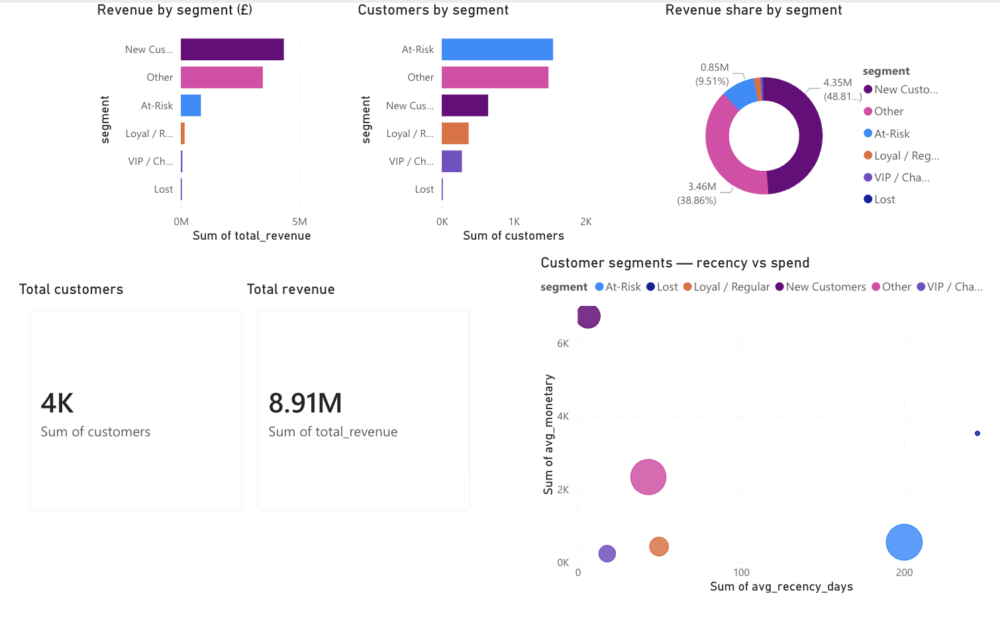
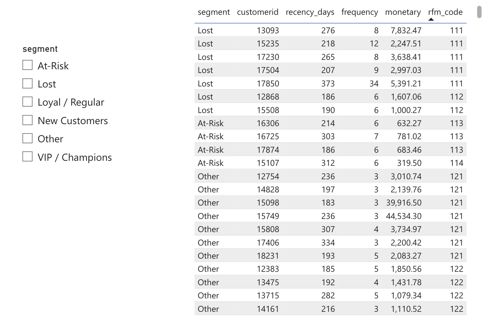

# RFM Customer Segmentation (PostgreSQL + Python + Power BI)

## Overview
This project segments customers using the **RFM framework**:
- **Recency**: days since last purchase  
- **Frequency**: number of unique purchases (invoices)  
- **Monetary**: total revenue contributed  

It produces actionable customer groups (VIP/Champions, Loyal/Regular, New Customers, At-Risk, Lost) and a Power BI dashboard for quick business insight.

---

## Dataset
**Online Retail (2010–2011)** transactional dataset.

Key fields used:
- `CustomerID`, `InvoiceNo`, `InvoiceDate`
- `Quantity`, `UnitPrice`
- Revenue computed as: `Quantity × UnitPrice`

---

## Method
### 1) Data Cleaning (SQL)
Filtered out:
- Cancellations (`InvoiceNo` starts with `C`)
- Returns / negative rows (`Quantity <= 0`)
- Invalid prices (`UnitPrice <= 0`)
- Missing customers (`CustomerID IS NULL`)

### 2) RFM Metrics (SQL)
Per customer:
- **Recency (days)** = days since last purchase  
- **Frequency** = count of unique invoices  
- **Monetary** = total revenue sum  

### 3) RFM Scoring (SQL)
Quintile scoring using window functions:
- **Recency**: smaller is better → mapped to higher score (1–5)
- **Frequency / Monetary**: larger is better (1–5)

### 4) Segmentation (SQL)
Rule-based segments:
- **VIP / Champions**
- **Loyal / Regular**
- **New Customers**
- **At-Risk**
- **Lost**
- **Other**

### 5) Export for BI (Python)
Exports Postgres tables into CSV for reporting:
- `outputs/rfm_segments.csv` (customer-level)
- `outputs/rfm_segment_summary.csv` (segment-level)

---

## Key Results (this run)
- Customers segmented: **4,338**
- Total revenue (dataset after cleaning): **8.91M**
- Dashboard highlights revenue + customer distribution by segment.

---

## Outputs
- `outputs/rfm_segments.csv`
- `outputs/rfm_segment_summary.csv`

---

## Dashboard (Power BI)
### Overview


### Customer Explorer


---

## Project Structure
```text
rfm-segmentation/
├─ src/
│  ├─ export_rfm.py
│  ├─ .env.example
│  └─ .env (local only; not committed)
├─ sql/
│  └─ (optional: your SQL scripts if you add them)
├─ outputs/
│  ├─ rfm_segment_summary.csv
│  └─ rfm_segments.csv (optional to commit if too large)
└─ powerbi/
   └─ dashboard_screenshots/
      ├─ 01_overview.png
      └─ 02_customer_explorer.png
